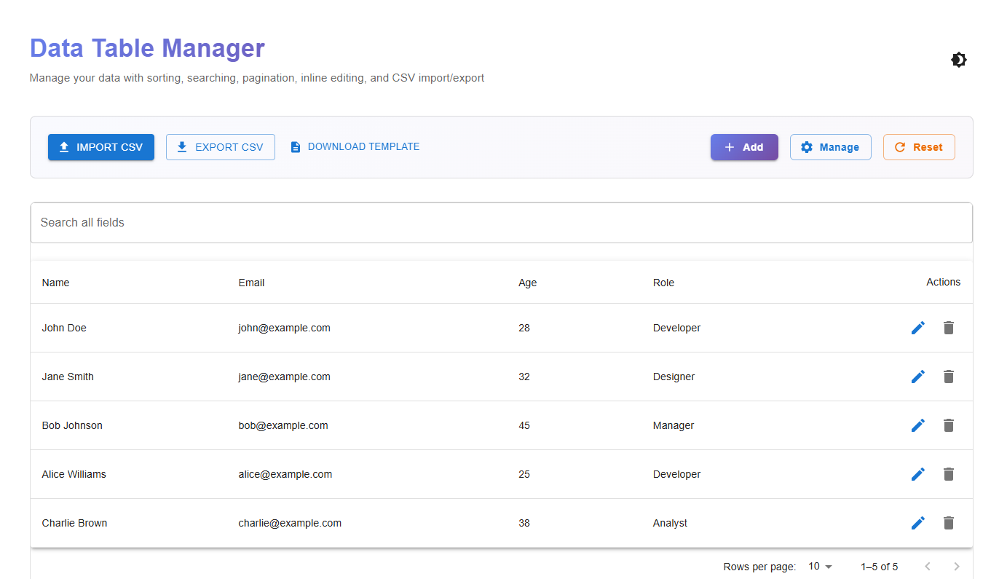
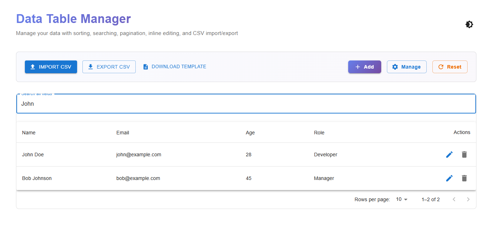
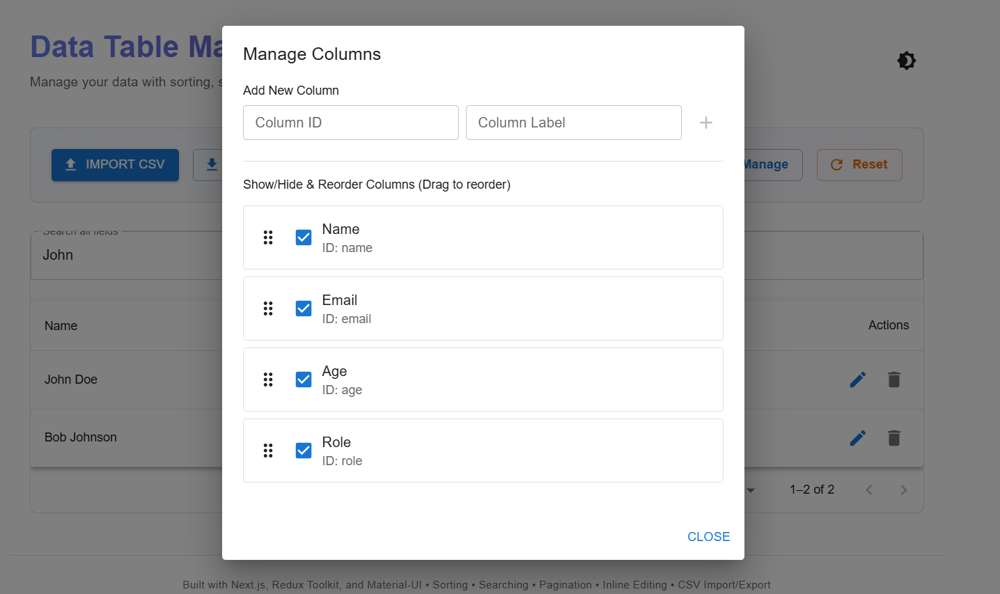
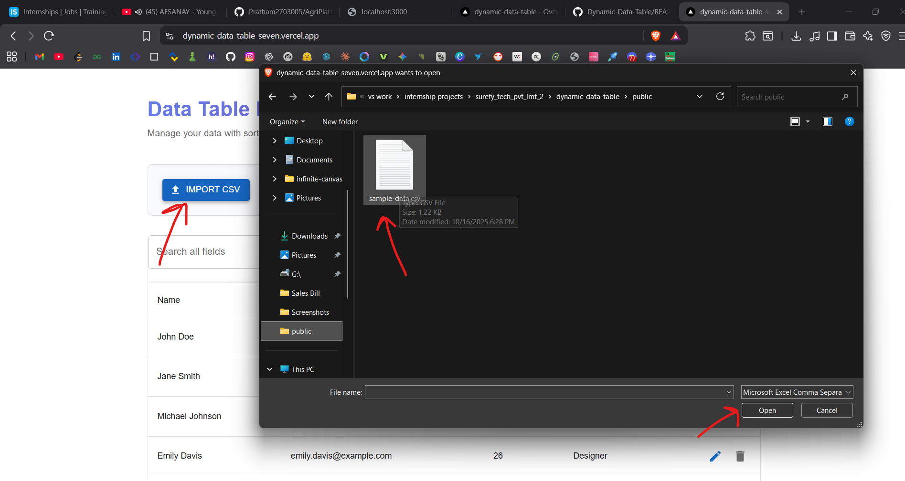
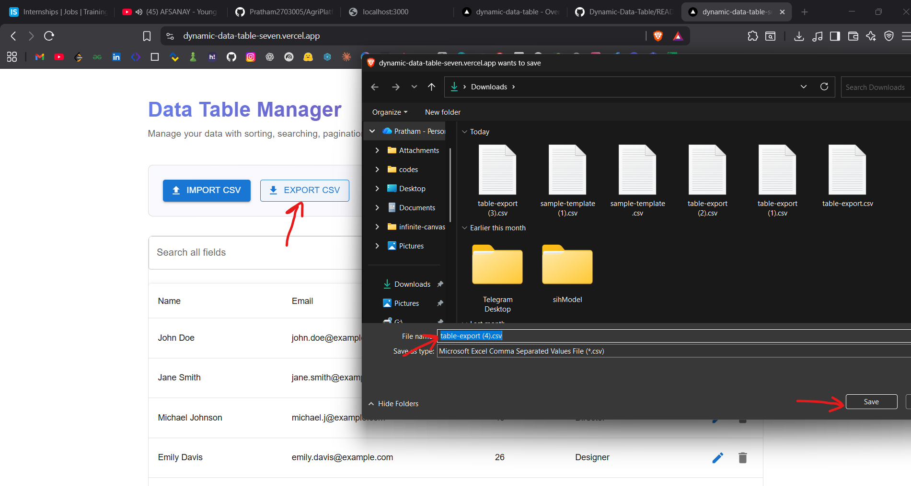
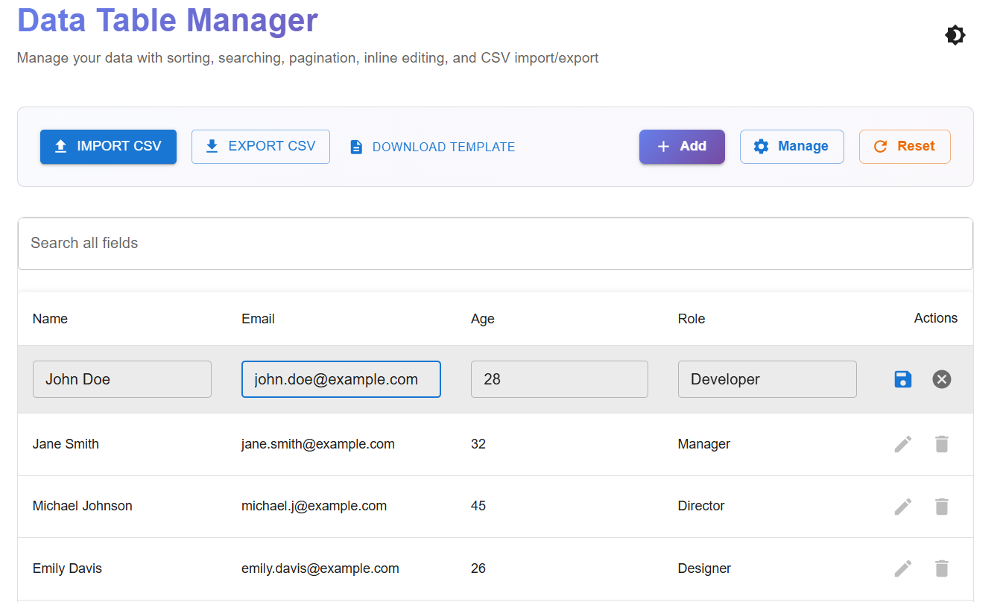
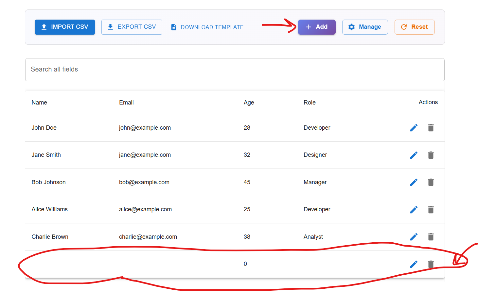
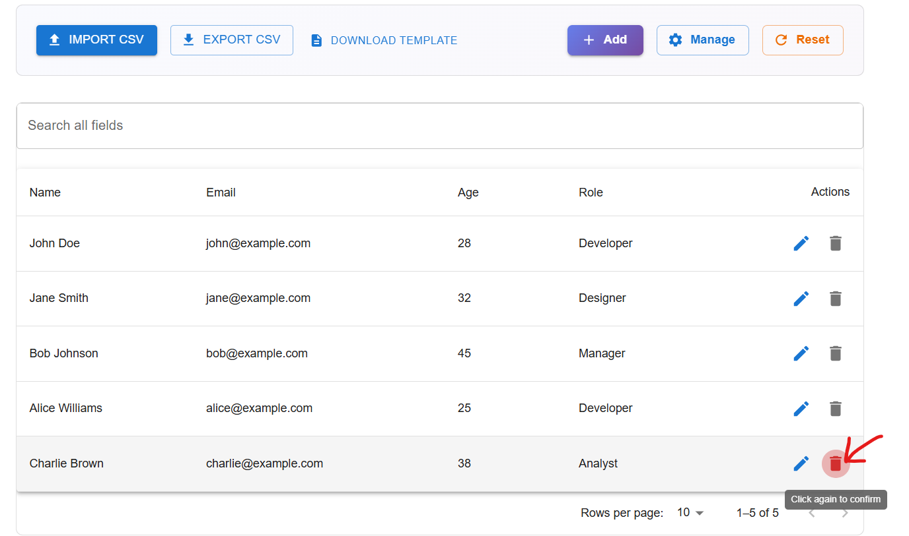
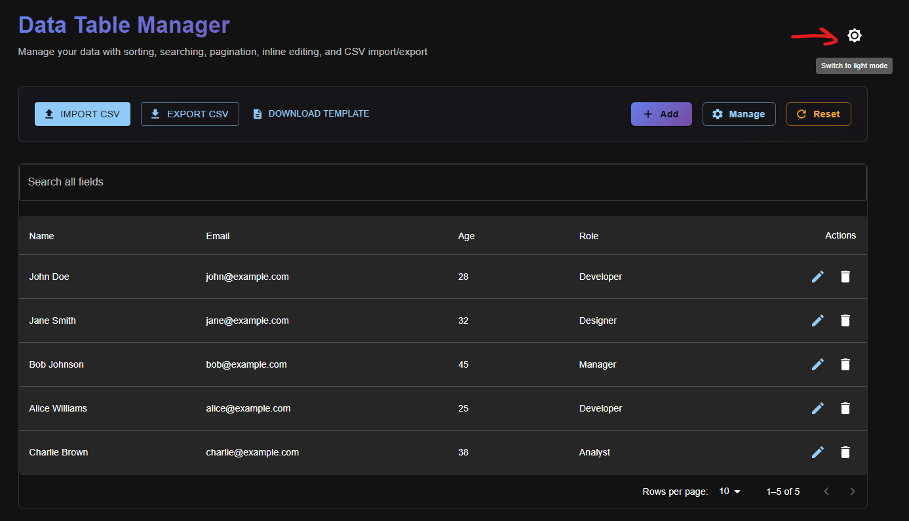

# 📊 Dynamic Data Table Manager

<p align="center">
  <a href="https://dynamic-data-table-seven.vercel.app/" target="_blank">
    
  </a>
</p>

## 🎯 Overview

This project demonstrates advanced React patterns including state management, CSV handling, inline editing, and dynamic UI updates. Perfect for managing tabular data with import/export capabilities.

---

## ✨ Features Walkthrough

### 1️⃣ **Table View with Sorting & Pagination**

Display data in a clean, sortable table with pagination controls.

**Implementation:**
- Material UI `Table` components for layout
- Click column headers to toggle ASC/DESC sorting
- Client-side pagination (10 rows per page)
- Redux manages sorting and pagination state



---

### 2️⃣ **Global Search**

Search across all fields in real-time.

**Implementation:**
- Search input filters all visible rows
- Case-insensitive matching
- Searches across Name, Email, Age, Role, Department, Location



---

### 3️⃣ **Manage Columns (Dynamic UI)**

Add new columns or show/hide existing ones dynamically.

**Implementation:**
- Modal dialog with checkboxes for visibility toggle
- Add custom columns (e.g., Department, Location, Salary)
- Changes reflect instantly in the table
- State persisted via Redux Persist in localStorage



---

### 4️⃣ **Import CSV**

Upload CSV files with validation and error handling.

**Implementation:**
- Uses **PapaParse** library for parsing
- Validates required fields (Name, Email)
- Email format validation
- Age range validation (0-150)
- Shows error messages for invalid rows

**How to test:**
- Use the provided `public/sample-data.csv` file
- Or create your own with columns: Name, Email, Age, Role, Department, Location



---

### 5️⃣ **Export CSV**

Download the current table view as a CSV file.

**Implementation:**
- Uses **FileSaver.js** for file download
- Only exports **visible columns**
- Respects current filters and sorting
- Generates proper CSV format with headers



---

### 6️⃣ **Inline Row Editing** 

Double-click any cell to edit it inline with validation.

**Implementation:**
- Double-click cell to enter edit mode
- Press Enter or click outside to save
- ESC to cancel editing
- Input validation (email format, age is numeric)
- Visual feedback with blue outline



---

### 7️⃣ **Add New Rows** 

Create new rows on the fly.

**Implementation:**
- "Add New Row" button creates empty row at top
- Fill in data using inline editing
- Auto-generates unique ID for each row
- Redux action dispatches new row to state



---

### 8️⃣ **Delete Rows** 

Remove rows with confirmation dialog.

**Implementation:**
- Delete icon button in each row
- Confirmation dialog prevents accidental deletion
- Redux action removes row from state



---

### 9️⃣ **Theme Toggle (Light/Dark Mode)** 

Switch between light and dark themes.

**Implementation:**
- Custom MUI theme with light/dark palettes
- Toggle button in header (sun/moon icon)
- Theme preference persisted in localStorage
- Smooth transition between themes



---

## 🛠️ Tech Stack

| Technology | Purpose |
|------------|---------|
| **Next.js 14** | React framework with App Router |
| **Redux Toolkit** | State management |
| **Redux Persist** | Persist state to localStorage |
| **Material UI v5** | Component library & theming |
| **TypeScript** | Type safety |
| **PapaParse** | CSV parsing |
| **FileSaver.js** | CSV export |

---

## 🚀 Quick Start

### Install Dependencies
```bash
git clone https://github.com/Pratham2703005/Dynamic-Data-Table.git
```

### Install Dependencies
```bash
npm install
```

### Run Development Server
```bash
npm run dev
```

Visit: [http://localhost:3000](http://localhost:3000)

### Build for Production
```bash
npm run build
npm start
```

---

## 📁 Project Structure

```
src/
├── app/
│   ├── layout.tsx              # Root layout with providers
│   ├── page.tsx                # Main page
│   ├── providers.tsx           # Redux + Theme providers
│   └── theme.ts                # Light/Dark theme config
├── components/
│   ├── DataTable.tsx           # Table with sorting & pagination
│   ├── ImportExport.tsx        # CSV import/export UI
│   ├── ManageColumnsModal.tsx  # Column visibility manager
│   ├── TableManager.tsx        # Main container
│   └── ThemeToggle.tsx         # Theme switcher
├── features/tables/
│   └── tableSlice.ts           # Redux slice (actions & reducers)
├── store/
│   ├── store.ts                # Redux store with persist
│   └── hooks.ts                # Typed useAppDispatch/useAppSelector
├── types/
│   └── index.ts                # TypeScript interfaces
└── utils/
    └── csvUtils.ts             # CSV parsing & export logic
```

---

## 📝 Key Implementation Details

### Redux State Management
- **tableSlice.ts**: Manages rows, columns, sorting, search, pagination
- **Redux Persist**: Auto-saves column visibility to localStorage
- **Typed Hooks**: `useAppDispatch` and `useAppSelector` for type safety

### CSV Import/Export
- **Case-insensitive** header matching (Name/name/NAME all work)
- **Validation**: Required fields, email format, age range
- **Error reporting**: Shows which rows failed validation

### Inline Editing
- Click cell → Edit mode → Validate → Save/Cancel
- Validation rules: Email format, Age 0-150, Required fields

### Responsive Design
- Mobile-friendly table with horizontal scroll
- Adaptive button layouts
- Touch-friendly edit interactions

---


## 📦 Sample Data

Test the app with: **`public/sample-data.csv`**
- 19 rows of sample data
- Includes: Name, Email, Age, Role, Department, Location
